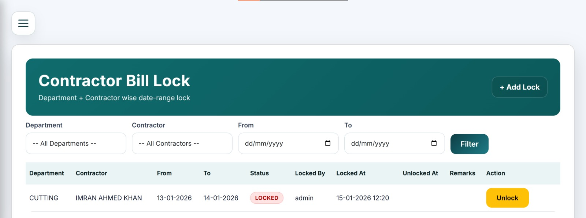
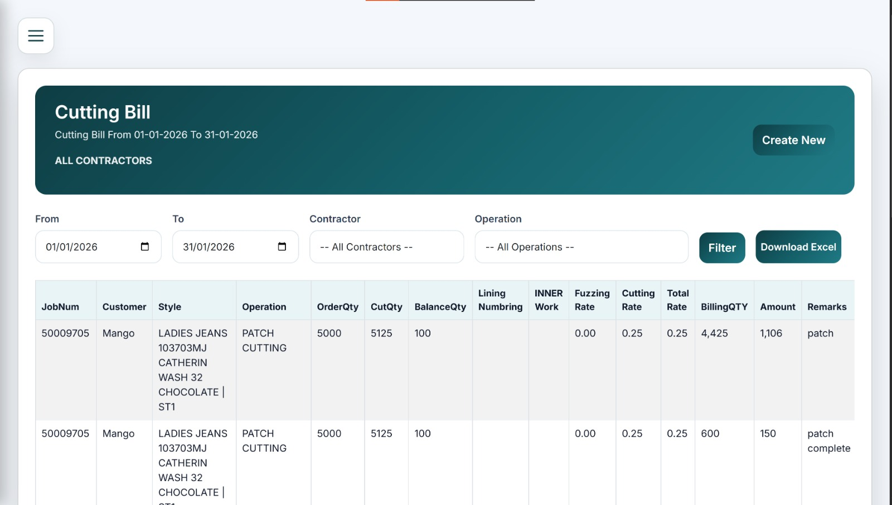

# .NET MVC Portfolio – Case Studies (Screenshots Only)

This repository contains .NET MVC project overviews and screenshots.
> Note: Source code is private due to client confidentiality.

---

## Project 1 — Contractor Payroll (ASP.NET MVC)

### Overview
A contractor payroll and billing management system with role-based access and reporting.

### Key Features
- Authentication + role-based access (Admin / Contractor)
- Contractor billing workflow (cutting bills / production count based)
- Bill lock mechanism (department + contractor + date-range locking)
- Reports and exports (daily/weekly/monthly summaries)
- Validation rules and audit-friendly flows

### Tech Stack
- ASP.NET MVC (C#)
- Entity Framework
- SQL Server
- jQuery / Bootstrap
- IIS Deployment

### Screenshots

---

## Project 2 — Machine Maintenance & Asset Management (ASP.NET MVC)

### Overview
A complete company asset and machine management system with department/unit/floor filters, QR-based machine lookup, and full breakdown/maintenance history tracking.

### Key Features
- Full machine/asset registry with filters (Department, Unit, Floor-wise)
- Unique QR code assigned to each machine for quick identification
- QR scan → machine details page (complete machine profile)
- Breakdown reporting system (issue type, report time, resolve time, downtime tracking)
- Maintenance cost tracking (purchase date, service history, cost per maintenance, total maintenance spend)
- Machine detail timeline view showing all issues and maintenance events

### Tech Stack
- ASP.NET MVC (C#)
- Entity Framework
- SQL Server
- QR code generation + scanning workflow
- IIS Deployment

